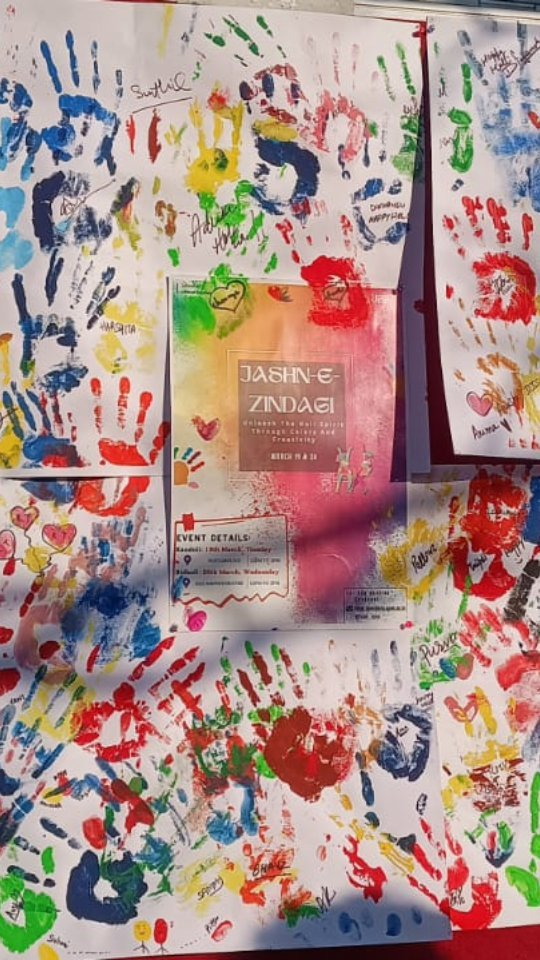

## Jashn-E-Zindagi (19th March - 20th March, 2024)

Falak celebrated the festival of Holi with Jashn-E-Zindagi, an event bursting with color, creativity and joy. From painting a collective handprint board to crafting colorful bracelets, participants were able to express themselves through art.

The event was a reminder to embrace your colors and honor the spirit of Holi by coming together, sharing stories and creating something beautiful. 🎨✨🌸

*🔗Click the image to watch the Reel on Instagram!*

