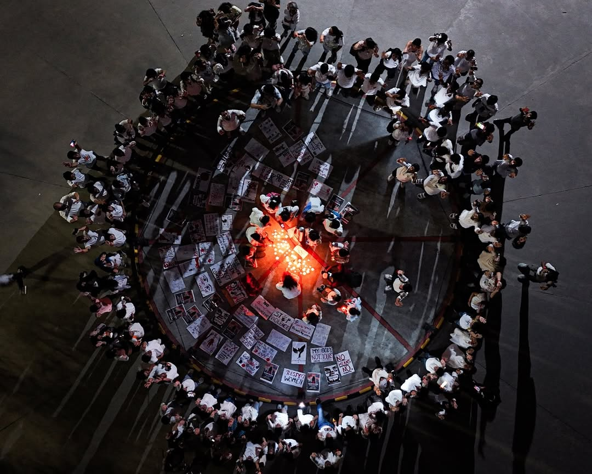

## Reclaim the Night (20th September, 2024)

Falak organized Reclaim the Night, a powerful march that advocated for women’s safety and the right to move freely without fear. 
Students and faculty came together to create posters, raise their voices against gender-based violence, and march in solidarity from one campus to another. 

It was a powerful demonstration of unity, with the entire community standing together in the fight for safer spaces.

*🔗Click the image to see the Post on Instagram!*

